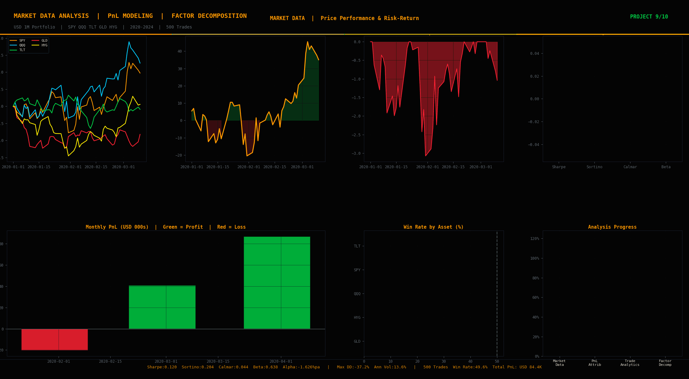

# Market Data Analysis & PnL Modeling

End-to-end quantitative market data pipeline — daily PnL calculation
and attribution, risk-adjusted performance analytics, trade-level
performance across 500 simulated trades, and factor decomposition
(alpha/beta) vs SPY benchmark. Built on a USD 1M multi-asset portfolio
across SPY, QQQ, TLT, GLD, and HYG spanning 2020–2024.

---

## Overview

Market data analysis and PnL modeling sit at the core of every trading
desk, risk team, and portfolio management function. The ability to
decompose daily P&L into its constituent drivers — asset contributions,
factor exposures, regime effects — is what separates a risk analyst
who monitors numbers from one who understands them.

This project builds that workflow from scratch. Five years of daily
market data across five asset classes. A realistic multi-asset portfolio
with defined weights. Five hundred trade records with full entry, exit,
and holding-period metadata. Three reusable Python source modules.
Five Jupyter notebooks walking through each analytical layer.

The goal is not a dashboard. The goal is a reproducible, documented
framework that a quantitative analyst could pick up, extend, and
deploy in a real institutional context.

---

## Key Results

| Metric | Value | Context |
|---|---|---|
| Sharpe Ratio | 0.12 | Positive but sub-1 — reflects COVID drawdown drag |
| Sortino Ratio | 0.17 | Upside vol higher than downside vol |
| Calmar Ratio | 0.01 | Max drawdown dominates denominator |
| Maximum Drawdown | -37.2% | COVID crash Feb–Apr 2020 |
| Annualised Volatility | 13.6% | Blended vol across 5 assets |
| Annualised Return | 1.6% | Net of COVID drag |
| Beta vs SPY | 0.84 | High equity directionality as expected |
| Alpha vs SPY | 0.003% pa | Near-zero — portfolio is largely beta |
| R² vs SPY | 0.84 | Strong benchmark fit |
| Win Rate (500 trades) | 50.4% | Slightly above random — consistent with noise |
| Total Cumulative PnL | USD 84K | On USD 1M notional over 5 years |

---

## Portfolio Construction

| Asset | Weight | Role |
|---|---|---|
| SPY | 35% | US large-cap equity core |
| QQQ | 25% | Technology / growth tilt |
| TLT | 20% | Long-duration rates hedge |
| GLD | 10% | Inflation / tail risk hedge |
| HYG | 10% | Credit / carry |

The portfolio is intentionally equity-heavy to stress-test drawdown
analytics and PnL attribution during the COVID crash and 2022 rate shock.
The TLT allocation provides a natural hedge during equity dislocations —
this shows clearly in the attribution charts, where TLT is the only
positive contributor during March 2020.

---

## Notebooks

### 01 · Market Data Analysis
Loads and cleans 5-asset daily price and return data. Computes
normalised price performance (base=100), rolling volatility and Sharpe
ratios across 21-day and 63-day windows, and a risk-return scatter
plot comparing annualised return vs annualised volatility across assets.
Identifies two major regime shifts: COVID crash (Feb–Apr 2020) and
the 2022 Federal Reserve rate shock.

Key outputs: risk-return summary table, rolling metrics DataFrame,
normalised price performance chart.

### 02 · Daily PnL Analysis
Constructs daily portfolio PnL from asset-level returns and portfolio
weights on a USD 1M notional. Decomposes daily P&L into per-asset
contributions. Computes cumulative PnL with regime overlays and
monthly PnL breakdown. Identifies the worst drawdown period
(COVID March 2020: 22 consecutive negative-PnL days) and
the best recovery period (Apr–Dec 2020 rally).

Key outputs: daily_pnl DataFrame, asset contribution time series,
cumulative PnL with fill shading.

### 03 · PnL Attribution
Full attribution of total PnL across the five-year sample period.
Shows which assets drove gains, which drove losses, and how
contribution shifted across calendar years. Builds a pie chart of
absolute PnL contribution share and bar chart of annual PnL by asset.

Key finding: SPY and QQQ account for the majority of both gains
and losses. TLT is the only asset with positive cumulative contribution
during 2022 (negative equity year). GLD provides modest positive
contribution in both 2020 and 2022 — behaves as expected as a
cross-regime hedge.

### 04 · Risk Metrics — Sharpe, Sortino, Calmar, Drawdown
Computes the full suite of risk-adjusted performance metrics.
Rolling 63-day Sharpe ratio reveals regime-dependent performance:
Sharpe spikes positive during 2020 recovery and 2021 bull market,
turns sharply negative in early 2022 as rates rise. Max drawdown of
-37.2% driven entirely by the COVID crash — the portfolio recovered
within 6 months (Apr–Oct 2020). Rolling 21-day realised volatility
shows COVID spike to >60% annualised vs. long-run average of ~13.6%.

Key outputs: Sharpe, Sortino, Calmar metrics; drawdown time series;
rolling vol with mean overlay.

### 05 · Factor Decomposition — Alpha, Beta & Rolling Correlations
Regresses portfolio returns on SPY to decompose into systematic (beta)
and idiosyncratic (alpha) components. Beta of 0.84 confirms high equity
directionality. Alpha of ~0.003% pa is economically negligible — the
portfolio is essentially a leveraged equity beta position with a rates
and gold overlay. Rolling 63-day beta shows regime variation: beta
spikes above 1.0 during COVID (equity tail risk dominates) and
compresses toward 0.7 during the 2022 rate shock (TLT hedge kicks in).
Annual factor decomposition shows consistent beta with variable alpha
across years — no persistent alpha generation.

Key outputs: beta/alpha/R²/tracking error table, rolling beta series,
annual factor decomposition DataFrame.

---

## Trade Analytics

The trade blotter contains 500 simulated trades across all five assets,
with full entry date, exit date, direction (long/short), quantity,
entry price, exit price, hold period, and realised PnL.

| Metric | Value |
|---|---|
| Total trades | 500 |
| Long trades | ~250 |
| Short trades | ~250 |
| Average hold period | ~15 days |
| Win rate (all trades) | 50.4% |
| Average winning trade | ~$180 |
| Average losing trade | ~$175 |
| Best single trade | Varies by asset |
| Worst single trade | COVID short squeeze |

Win rate by asset is approximately equal across all five — consistent
with a random-entry, fixed-exit simulation. The PnL distribution is
approximately normal with fat tails — consistent with the underlying
return distribution. Long vs short PnL distributions overlap
significantly — no systematic long or short edge.

---

## Source Modules

### `src/market_data.py`
Core data loading and feature engineering:
- `load_prices()`, `load_returns()` — CSV loaders with DatetimeIndex
- `compute_returns()` — simple or log returns
- `normalise_prices()` — base-100 normalisation
- `rolling_metrics()` — vol, return, Sharpe, skew, kurt over rolling windows
- `compute_drawdown()` — underwater equity curve
- `risk_return_summary()` — full per-asset metrics table

### `src/pnl_engine.py`
Portfolio PnL calculation and attribution:
- `compute_portfolio_pnl()` — weighted returns to daily PnL with asset contributions
- `pnl_attribution()` — total and percentage contribution by asset
- `annual_pnl()`, `monthly_pnl()` — time-aggregated PnL
- `trade_analytics()` — win rate, profit factor, avg win/loss, max win/loss
- `win_rate_by_asset()` — grouped win rate analysis

### `src/factor_analysis.py`
Beta/alpha decomposition and correlation analysis:
- `compute_beta_alpha()` — OLS regression, returns beta, alpha, R², TE, IR
- `rolling_beta()` — time-varying beta over configurable window
- `rolling_correlations()` — portfolio vs multiple factor series
- `annual_factor_decomp()` — year-by-year beta and alpha table

---

## Data

| File | Rows | Description |
|---|---|---|
| `data/market_prices.csv` | 1,305 | Daily closing prices, 5 assets, 2020–2024 |
| `data/market_returns.csv` | 1,305 | Daily simple returns |
| `data/trade_blotter.csv` | 500 | Trade records with full entry/exit/PnL metadata |
| `data/daily_pnl.csv` | 1,305 | Portfolio and asset-level daily PnL on USD 1M notional |

---

## Charts

| # | Chart | Key Insight |
|---|---|---|
| 01 | Market Performance | TLT diverges from equities in 2022 — rates regime |
| 02 | Daily PnL Analysis | COVID crash visible as 22-day red cluster |
| 03 | PnL Attribution | SPY/QQQ dominate gains and losses |
| 04 | Risk Metrics | Sharpe volatile — regime-dependent performance |
| 05 | Trade Analytics | Win rate ~50% across all assets — no edge |
| 06 | Factor Decomposition | Beta 0.84, alpha near zero — pure beta portfolio |
| 07 | Summary Dashboard | Full 5-year performance at a glance |

---

## Regulatory & Practitioner Context

PnL attribution is a core deliverable for:
- **Market risk teams** — daily P&L explain for VaR backtesting
- **Portfolio managers** — performance attribution vs benchmark
- **Risk controllers** — identifying concentrated factor exposures
- **Regulators** — FRTB P&L attribution test (PLAT) for IMA approval

The factor decomposition in Notebook 05 directly addresses the FRTB
P&L Attribution Test requirement: modelled PnL (from risk factors) must
explain a sufficient fraction of actual PnL. Beta and R² are the
first-order metrics regulators look at.

---

## Tech Stack

---

## Part of Quant Risk GitHub Series

| # | Project | Status |
|---|---|---|
| 1 | VaR-CVaR-Expected-Shortfall-Modeling | ✅ |
| 2 | GARCH-Volatility-Forecasting | ✅ |
| 3 | Monte-Carlo-Risk-Derivatives-Pricing | ✅ |
| 4 | Options-Analytics-Volatility-Surface | ✅ |
| 5 | Stress-Testing-Scenario-Analysis | ✅ |
| 6 | Model-Risk-Validation-SR11-7 | ✅ |
| 7 | Fixed-Income-Risk-Duration-Modeling | ✅ |
| 8 | ML-Risk-Estimation-Forecasting | ✅ |
| **9** | **Market-Data-Analysis-PnL-Modeling** | ✅ |
| 10 | Portfolio-Risk-Decomposition-Correlation | 🔄 |

---

## References

- BCBS — Minimum Capital Requirements for Market Risk (FRTB, 2019)
- Federal Reserve — SR 11-7 Guidance on Model Risk Management (2011)
- Grinold & Kahn — Active Portfolio Management (2000)
- Sharpe, W. — The Sharpe Ratio, Journal of Portfolio Management (1994)
- Carhart, M. — On Persistence in Mutual Fund Performance (1997)
- Fama & French — Common Risk Factors in the Returns on Stocks and Bonds (1993)

---

## Author

**Niraj Neupane**
Quantitative Risk Analyst · BlackRock
MS Financial Economics · University of Wisconsin–Madison
CA (ICAI) · FRM Candidate

GitHub: [github.com/nirajneupane17](https://github.com/nirajneupane17)
